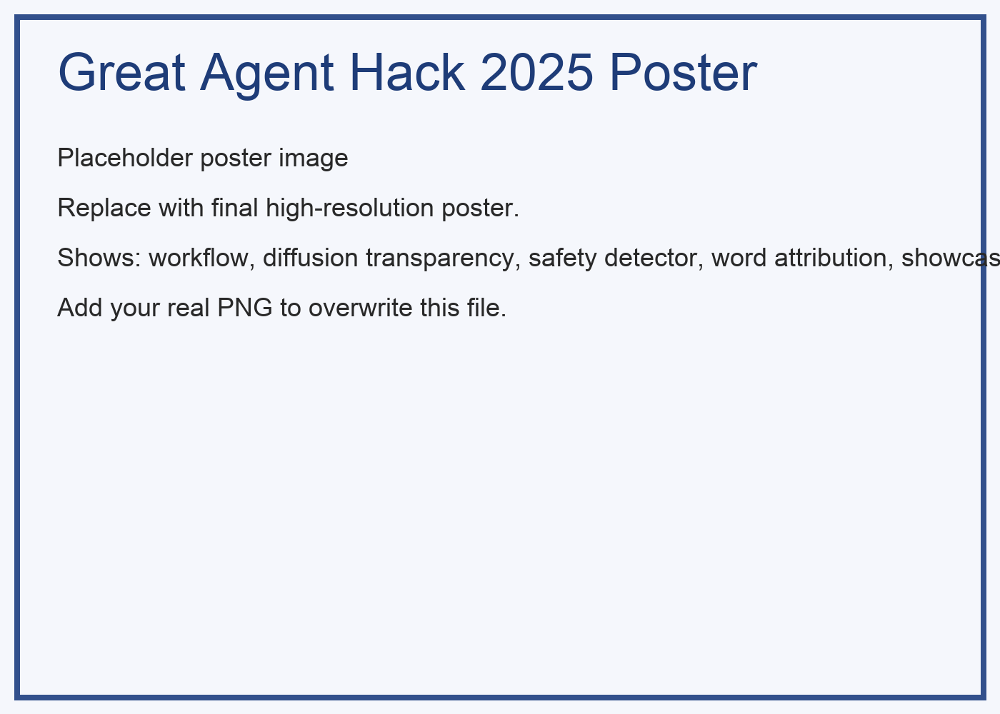

<div style="display:flex; align-items:flex-start; justify-content:space-between;">
  <div style="flex:1;">
    <h1>GenAI & Explainer: FLUX.1-Kontext Diffusion Model Transparency </h1>
    <p>
      <a href="https://www.python.org/downloads/"></a>
      <a href="https://opensource.org/licenses/MIT"></a>
      <a href="https://hackathon.holisticai.com/"></a>
    </p>
    <h3>🥉 3rd Place – Agent Glass Box Track (Great Agent Hack 2025)</h3>
    <p><em>Co-hosted by Holistic AI and University College London • Nov 15–16, 2025 • UCL East Campus, London</em></p>
  </div>
</div>

<div align="center" style="margin:18px 0 28px;">
  
  <p><em>Official Poster: End-to-end transparency for diffusion-based brand-aware generation.</em></p>
</div>

---

Companies use creative merchandise to strengthen brand identity and engage audiences, yet diffusion models can feel unpredictable—how they detect the main subject, keep it stable, or react to guidance is often unclear. This project combines an LLM agent with visual explainability tooling to provide **full image-generation transparency**. It exposes intermediate diffusion states, word-level influence, and safety validation so users can iteratively refine structured prompts for brand-consistent outputs.

### The Problem
Diffusion models reverse a forward noising process, but the internal trajectory (which words influence which pixels, when logo fidelity stabilizes, why colors shift) is rarely exposed. Lack of transparency makes controlled design and safe deployment harder—especially for regulated, branded, or seasonal merchandise generation.

### Glass Box Achievement
In the **Agent Glass Box Track**, the challenge was to “follow the trajectory, understand the behavior.” Our solution captured every critical stage of generation: safety gating, structured prompt expansion, progressive latent decoding, cross-attention influence visualization, and keyword ablation. The judging emphasized transparency, auditability, and actionable interpretability. We placed **3rd** by demonstrating:
1. Reproducible, instrumented diffusion runs with timestep decoding.
2. Empirical word impact measurement via automated ablation.
3. Layered safety enforcement (keywords → LLM policy → schema validation).
4. Human-readable dashboards aligning system state, visual evidence, and reasoning.

---

## 🚀 Quick Start

### Use Cases

Perfect for creating brand-consistent merchandise:
- **🎅 Holiday Mug Designs**: Transform logos into festive coffee cup graphics
- **👕 T-Shirt Graphics**: Adapt brand identity for apparel with seasonal themes
- **🎁 Gift Bag Artwork**: Create holiday packaging designs with wrapping elements

### Our Solution: The GREAT AGENT Workflow

Our agent tackles this by combining an LLM agent with visual explainability tools:

1. **👤 User Input**: Provide text prompts and/or images (e.g., company logo)
2. **📝 Structured Prompt Generation**: LLM agent creates detailed, compliant prompts with safety checks (profanity filter, LLM safety evaluation)
3. **🤖 Explainer Pipeline**: Transparent analysis of the diffusion process
4. **✨ Final Output**: Brand-consistent merchandise designs with full transparency

### Core Capabilities

- **🛡️ LLM Safety Detector**: Multi-layer content moderation
  - Keyword filtering blocks profanity and inappropriate content
  - LLM safety check evaluates prompts against policy categories
  - Structured output validation ensures compliant results

- **🎨 Image Generation with Transparency**
  - **Step-by-Step Denoising**: Visualize how diffusion models reverse the forward noising process
  - **Cross-Attention Maps**: See how the model understands the prompt and which parts influence the emerging image
  - **Word Ablation Analysis**: Measure each keyword's influence by removing words individually and regenerating

- **🔬 Visual Explainability Tools**
  - Real-time diffusion process visualization (every 7 steps)
  - Cross-attention heatmaps showing prompt understanding
  - Word attribution through ablation studies
  - Evolution grids showing complete generation timeline

- **📊 Interactive Analysis Dashboards**
  - Generator Dashboard: Create images with live progress tracking
  - Analysis Dashboard: Review results, evolution timelines, and word impact rankings
  - LLM-powered feedback with improvement suggestions

- **🧠 AI-Powered Insights**
  - Automated prompt adherence analysis
  - Logo preservation assessment
  - Design quality evaluation
  - Word effectiveness scoring
  - Actionable improvement recommendations

## 📁 Project Structure

```
Explainable-AI/
├── dashboards/              # Interactive Gradio web interfaces
│   ├── flux_generator_dashboard.py    # Image generation interface
│   ├── analysis_dashboard.py          # Results analysis interface
│   └── launch.py                       # Quick launcher script
├── src/                     # Source code
│   ├── agents/              # LangChain agents for prompt generation
│   │   ├── interact_agent.py          # Main agent with safety filtering
│   │   ├── context.py
│   │   ├── create_agent.py
│   │   └── ...
│   ├── core/                # Core utilities and tools
│   │   ├── retrievers.py
│   │   └── tools.py
│   └── flux/                # FLUX model utilities
│       ├── flux_server.py             # Flask API for FLUX generation
│       └── flux_logo_editor.py
├── notebooks/               # Jupyter notebooks for experimentation
│   ├── Demo.ipynb
│   ├── Flux Kontext Model.ipynb
│   ├── LLM Analysis.ipynb
│   └── ...
├── outputs/                 # Generated outputs and experiments
│   ├── experiments/flux_experiments/  # Timestamped experiment runs
│   ├── demo_outputs/
│   └── ...
├── scripts/                 # Utility scripts
├── config/                  # Configuration files
├── assets/                  # Static assets (images, logos)
├── requirements.txt         # Python dependencies
└── README.md               # This file
```

## 🎯 How It Works: Diffusion Model with Text & Image Conditioning

### Forward Diffusion (Training)
FLUX.1-Kontext learns to predict noise $\mu_t$ at each timestep by understanding both text and image conditions:

```
x_t → predict noise μ_t → x_{t-1}
```

### Reverse Diffusion (Generation)
Starting from noise, the model iteratively denoises using:

**Text Conditioning (Approach A)**:
- Encoding via Concatenation
- Text embeddings inject semantic meaning into each channel
- Example: "add a Christmas hat"

**Image Conditioning (ControlNet/Adapter)**:
- Control Net or Adapter modules guide spatial layout
- Preserves structure while allowing creative transformation
- Example: Maintains logo shape while applying festive theme

### Our Explainability Pipeline

1. **Conditional Reverse Step**: At each timestep, we capture:
   - Current latent state $x_t$
   - Predicted noise $\mu_t$
   - Cross-attention weights

2. **Visual Decoding**: Every 7 steps, we decode latents into visible images

3. **Analysis**:
   - **Evolution Grids**: Show the complete generation timeline
   - **Cross-Attention Maps**: Reveal which prompt words guide which image regions
   - **Word Ablation**: Empirically measure each word's contribution

### Prerequisites

- Python 3.8 or higher
- CUDA-compatible GPU (recommended for FLUX model)
- 16GB+ RAM
- 20GB+ free disk space

### Installation

1. **Clone the repository**
```bash
git clone https://github.com/ArunJoseph19/Explainable-AI.git
cd Explainable-AI
```

2. **Create a virtual environment**
```bash
python -m venv venv
source venv/bin/activate  # On Windows: venv\Scripts\activate
```

3. **Install dependencies**
```bash
pip install -r requirements.txt
```

4. **Set up API keys**

Create a `.env` file in the project root:
```bash
# AWS Bedrock (via Holistic AI)
HOLISTIC_AI_TEAM_ID=your_team_id
HOLISTIC_AI_API_TOKEN=your_api_token

# OpenAI (alternative)
OPENAI_API_KEY=your_openai_key

# Valyu Search
VALYU_API_KEY=your_valyu_key
```

### Running the Application

#### Option 1: Quick Launch (Interactive Menu)
```bash
python dashboards/launch.py
```

#### Option 2: Launch Dashboards Separately

**Generator Dashboard** (Port 7862):
```bash
python dashboards/flux_generator_dashboard.py
```

**Analysis Dashboard** (Port 7861):
```bash
python dashboards/analysis_dashboard.py
```

#### Option 3: Flask API Server
```bash
python src/flux/flux_server.py
```

## 📖 Usage Guide

### 1. Generate Images

1. Open the **Generator Dashboard** at `http://localhost:7862`
2. Click **"Load FLUX Model"** (one-time setup, ~2 minutes)
3. Upload an input image (logo or design)
4. Click **"Generate Prompt with AI"** to create an optimized prompt
5. Review the safety check results
6. Click **"Generate All Scenarios"** to create variations for:
   - Mug designs
   - T-shirt designs
   - Gift bag designs

The system automatically generates:
- Final output images
- Evolution grids (diffusion process)
- Word attribution visualizations
- Timestep snapshots

### 2. Analyze Results

1. Open the **Analysis Dashboard** at `http://localhost:7861`
2. The latest experiment loads automatically
3. Select a scenario and prompt variant
4. Review visualizations:
   - **Input/Output Comparison**: See before and after
   - **Word Attribution**: Understand which words matter most
   - **Evolution Timeline**: Scrub through generation steps
   - **Ablation Studies**: View images with specific words removed

5. Run LLM analysis:
   - Choose an LLM model (Claude recommended)
   - Click **"Analyze with LLM"**
   - Get detailed feedback on:
     - Prompt adherence
     - Logo preservation
     - Design quality
     - Word effectiveness
     - Improvement suggestions

## 🔬 Key Technologies

### Core Framework
- **FLUX.1-Kontext-dev**: State-of-the-art diffusion model with text and image conditioning
- **U-Net Architecture**: Forward and reverse diffusion with cross-attention layers
- **LangChain Agents**: Structured prompt generation with tool orchestration
- **Gradio**: Interactive web interfaces for generation and analysis

### AI & ML Stack
- **AWS Bedrock**: Claude LLM access (via Holistic AI partnership)
- **Diffusers**: Hugging Face diffusion model library with custom callbacks
- **PyTorch**: Deep learning framework with bfloat16 optimization
- **Valyu AI**: Web search tool integration for agent context

### Analysis & Visualization
- **Cross-Attention Analysis**: Extract and visualize attention maps at each transformer layer
- **VAE Decoding**: Convert latents to images at intermediate timesteps
- **Ablation Framework**: Automated word removal and regeneration pipeline
- **Matplotlib**: High-quality visualization of evolution grids and heatmaps

### Safety & Compliance
- **Better Profanity**: Keyword-based content filtering
- **LLM Safety Evaluation**: Multi-category policy checking (violence, explicit content, hate speech, illegal activities, self-harm)
- **Pydantic**: Structured output validation with type safety

## 📊 Experiment Output Structure

Each experiment run creates:
```
outputs/experiments/flux_experiments/run_YYYYMMDD_HHMMSS/
├── input_image.png
├── mug_design/
│   └── prompt_0_generated/
│       ├── final_output.png
│       ├── evolution_grid.png
│       ├── word_attribution_complete.png
│       ├── metadata.json
│       ├── snapshots/
│       │   ├── step_000_t1000.0.png
│       │   ├── step_007_t875.0.png
│       │   └── ...
│       ├── ablated_without_festive.png
│       └── llm_analysis/
│           └── claude_3.5_sonnet_analysis.json
├── tshirt_design/
└── giftbag_design/
```

## 🧪 Notebooks

Explore the `notebooks/` directory for:
- `Demo.ipynb`: Basic usage examples
- `Flux Kontext Model.ipynb`: Model exploration
- `LLM Analysis.ipynb`: LLM integration examples
- `Dashboard FLUX.ipynb`: Dashboard development

## 🔒 Safety Features

Our multi-layer safety system ensures compliant and appropriate outputs:

### Layer 1: Keyword Filtering
- **Better Profanity** library with comprehensive wordlist
- Real-time input validation before processing
- Deterministic guardrail blocks banned content immediately

### Layer 2: LLM Safety Check
Claude evaluates prompts against **5 Safety Policy Categories**:

1. **Violence & Gore**: Descriptions of extreme violence, weapons, combat, torture
2. **Explicit & Sexual Content**: Nudity, sexual acts, fetishes, suggestive imagery
3. **Hate Speech & Discrimination**: Discriminatory symbols, stereotypes, targeted insults
4. **Illegal Activities**: Drug use, gambling, terrorism, theft, illegal acts
5. **Self-Harm**: Suicide, self-injury, glorification of mental distress

### Layer 3: Structured Output Validation
- **JSON Schema Validation**: Ensures prompt structure correctness
- **Pydantic Type Safety**: Enforces data types and required fields
- **Safety Flag**: Binary safe/unsafe boolean in every response

### Workflow Integration
```
User Input → Keyword Filter → LLM Safety Check → Validation → Generation
            ❌ Block          ❌ Block           ❌ Block      ✅ Safe
```

All unsafe content is blocked **before** reaching the diffusion model, ensuring no computational resources are wasted on policy-violating requests.

## 🤝 Contributing

Contributions are welcome! Please:
1. Fork the repository
2. Create a feature branch (`git checkout -b feature/AmazingFeature`)
3. Commit your changes (`git commit -m 'Add some AmazingFeature'`)
4. Push to the branch (`git push origin feature/AmazingFeature`)
5. Open a Pull Request

## 📄 License

This project is licensed under the MIT License - see the LICENSE file for details.

## 🙏 Acknowledgments

### Hackathon
- **Great Agent Hack 2025** - Co-hosted by Holistic AI and University College London
- **Holistic AI** for AWS Bedrock API access and technical support

### Technology Partners
- **Black Forest Labs** for FLUX.1-Kontext-dev diffusion model
- **Anthropic** for Claude LLMs with vision capabilities
- **Hugging Face** for model hosting, diffusers library, and community
- **NVIDIA** for GPU optimization and CUDA support
- **AWS** for Bedrock infrastructure
- **FGIM, Valyu** for tool integrations

### Team
**Arun Josephraj, Chenyi Huang, Victor Hu**

Project developed during the Great Agent Hack 2025 hackathon. Awarded **🥉 3rd Place in the Agent Glass Box Track** for advancing diffusion transparency.

## 📧 Contact

**Team Members:**
- **Arun Josephraj** - [@ArunJoseph19](https://github.com/ArunJoseph19)
- **Chenyi Huang**
- **Victor Hu**

**Repository**: [Explainable-AI](https://github.com/ArunJoseph19/Explainable-AI)

**Hackathon**: [Great Agent Hack 2025](https://hackathon.holisticai.com/)

For questions, issues, or collaboration opportunities, please open a GitHub issue or reach out via the hackathon platform.

## 🐛 Troubleshooting

### Common Issues

**Out of Memory Errors:**
- Reduce `MAX_RESOLUTION` in dashboards
- Enable more aggressive CPU offloading
- Close other GPU applications

**Model Loading Fails:**
- Check internet connection
- Verify Hugging Face authentication
- Ensure sufficient disk space

**API Errors:**
- Verify API keys in `.env`
- Check rate limits
- Review Holistic AI team quota

**Import Errors:**
- Reinstall dependencies: `pip install -r requirements.txt --upgrade`
- Check Python version (3.8+ required)

## 🗺️ Roadmap

### Explainability Enhancements
- [ ] Layer-wise attention visualization
- [ ] Token-level attribution heatmaps
- [ ] Comparative analysis across multiple models
- [ ] Interactive attention map exploration

### Feature Additions
- [ ] Batch processing for multiple images
- [ ] Custom scenario templates beyond merchandise
- [ ] Video generation with temporal coherence
- [ ] API endpoints for programmatic access
- [ ] Fine-tuning capabilities for brand-specific styles

### Infrastructure
- [ ] Docker containerization for easy deployment
- [ ] Cloud deployment (AWS/GCP) templates
- [ ] Optimization for consumer GPUs
- [ ] Web-based demo without local installation

### Research Extensions
- [ ] Quantitative metrics for prompt adherence
- [ ] User study framework for explainability effectiveness
- [ ] Comparison with other diffusion models (Stable Diffusion, Midjourney)
- [ ] Academic paper documenting methodology

---

**Developed for Great Agent Hack 2025 🏆**

**Star ⭐ this repository if you find it useful!**
